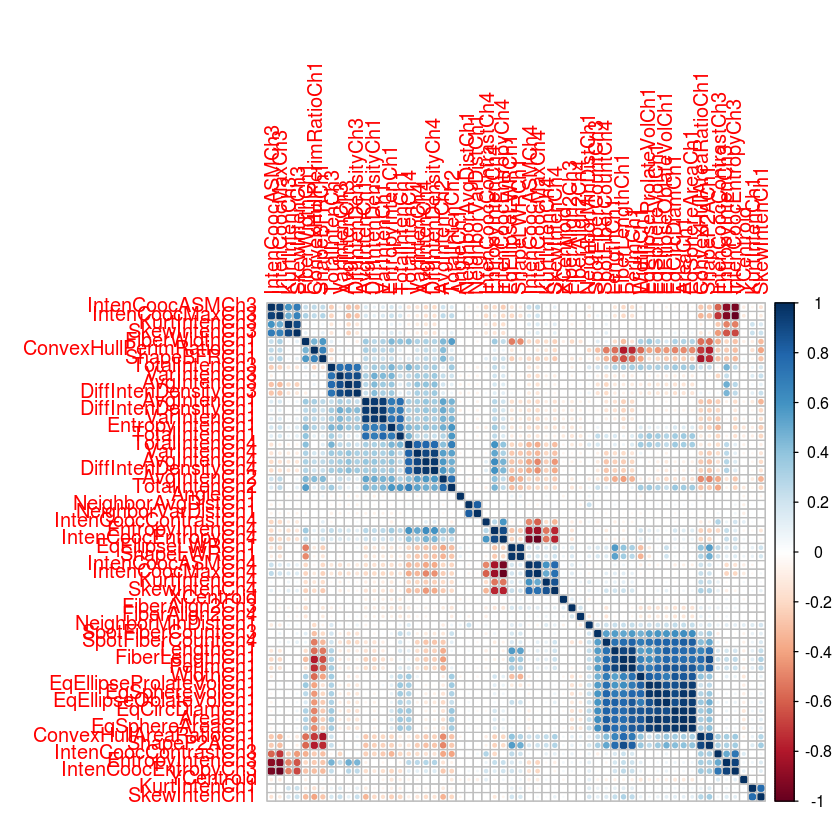

# Applied Predictive Modeling with R


```R
# find functions for creating confusion matrix within the currenltly loaded packages
print(apropos("confusion"))

# Find such a function in any package. Opens a new browser window
#RSiteSearch("confusion", restrict = "functions")
```

    character(0)


### Install AppliedPredictiveModeling package


```R
#install.packages(c('AppliedPredictiveModeling'))
```

### Load Applied Predictive Modeling Package


```R
library(AppliedPredictiveModeling)
```

Load the data into R


```R
data(segmentationOriginal)
segData <- subset(segmentationOriginal, Case == "Train")
```

Save Class and Cell fields into separate vectors and then remove them from the main object


```R
cellId <- segData$Cell
class <- segData$Class
case <- segData$Case

# Now remove the columns
segData <- segData[,-(1:3)]
```

The original data contained several "status" columns which were binary versions of the predictors.
To remove these, we find the column names containing "Status" and remove them


```R
statusColNum <- grep("Status", names(segData))
statusColNum
```

<ol class=list-inline>
	<li>2</li>
	<li>4</li>
	<li>9</li>
	<li>10</li>
	<li>11</li>
	<li>12</li>
	<li>14</li>
	<li>16</li>
	<li>20</li>
	<li>21</li>
	<li>22</li>
	<li>26</li>
	<li>27</li>
	<li>28</li>
	<li>30</li>
	<li>32</li>
	<li>34</li>
	<li>36</li>
	<li>38</li>
	<li>40</li>
	<li>43</li>
	<li>44</li>
	<li>46</li>
	<li>48</li>
	<li>51</li>
	<li>52</li>
	<li>55</li>
	<li>56</li>
	<li>59</li>
	<li>60</li>
	<li>63</li>
	<li>64</li>
	<li>68</li>
	<li>69</li>
	<li>70</li>
	<li>72</li>
	<li>73</li>
	<li>74</li>
	<li>76</li>
	<li>78</li>
	<li>80</li>
	<li>82</li>
	<li>84</li>
	<li>86</li>
	<li>88</li>
	<li>92</li>
	<li>93</li>
	<li>94</li>
	<li>97</li>
	<li>98</li>
	<li>103</li>
	<li>104</li>
	<li>105</li>
	<li>106</li>
	<li>110</li>
	<li>111</li>
	<li>112</li>
	<li>114</li>
</ol>


```R
segData <- segData[,-statusColNum]
```

## **Transformations**

#### Skewness
The e1071 package calculates the sample skewness statistic for each predictor


```R
library(e1071)

#For one predictor:
skewness(segData$AngleCh1)

# Since all predictors are numeric columns, the apply function can 
# be used to computre skewness accross columns
# apply(data, 1=Col, 2=Rows, c(1,2) = Row and Col, function)
skewValues <- apply(segData, 2, skewness)
head(skewValues)
```


-0.024262516546972


<dl class=dl-horizontal>
	<dt>AngleCh1</dt>
		<dd>-0.024262516546972</dd>
	<dt>AreaCh1</dt>
		<dd>3.52510744966065</dd>
	<dt>AvgIntenCh1</dt>
		<dd>2.9591852447557</dd>
	<dt>AvgIntenCh2</dt>
		<dd>0.848160329578199</dd>
	<dt>AvgIntenCh3</dt>
		<dd>2.20234214371746</dd>
	<dt>AvgIntenCh4</dt>
		<dd>1.9004712817314</dd>
</dl>


Asses shape of distribution


```R
hist(skewValues)
```


Use boxcox contained in the MASS package to determine which type of transformation we should use


```R
library(caret)
Ch1AreaTrans <- BoxCoxTrans(segData$AreaCh1)
Ch1AreaTrans
```

    Loading required package: lattice
    Loading required package: ggplot2


    Box-Cox Transformation
    
    1009 data points used to estimate Lambda
    
    Input data summary:
       Min. 1st Qu.  Median    Mean 3rd Qu.    Max. 
      150.0   194.0   256.0   325.1   376.0  2186.0 
    
    Largest/Smallest: 14.6 
    Sample Skewness: 3.53 
    
    Estimated Lambda: -0.9 


**Original Data**


```R
head(segData$AreaCh1)
```


<ol class=list-inline>
	<li>819</li>
	<li>431</li>
	<li>298</li>
	<li>256</li>
	<li>258</li>
	<li>358</li>
</ol>


**After Transformation**


```R
predict(Ch1AreaTrans, head(segData$AreaCh1))
```


<ol class=list-inline>
	<li>1.10845771566787</li>
	<li>1.10638256152745</li>
	<li>1.10451993595484</li>
	<li>1.1035542485825</li>
	<li>1.10360699137253</li>
	<li>1.10552302915978</li>
</ol>


```R
# Compute manually
(819^(-.9)-1)/(-.9)
```


1.10845771566787


Another caret function preProcess, applies this transformation to a set of predictors.

Base R function prcomp can be used for PCA. Data below is centered and scaled prior to PCA


```R
pcaObject <- prcomp(segData, center = TRUE, scale. = TRUE)

# Calculate the cumulative percentage of variance which each component accounts for
percentVariance <- pcaObject$sd^2/sum(pcaObject$sd^2)*100
percentVariance[1:3]
```


<ol class=list-inline>
	<li>20.9123592789234</li>
	<li>17.0133003625848</li>
	<li>11.886891590935</li>
</ol>


The transformed values are stored in pcaObject as a sub-object called x:


```R
head(pcaObject$x[,1:5])
```


<table>
<thead><tr><th></th><th scope=col>PC1</th><th scope=col>PC2</th><th scope=col>PC3</th><th scope=col>PC4</th><th scope=col>PC5</th></tr></thead>
<tbody>
	<tr><th scope=row>2</th><td> 5.0985749 </td><td> 4.5513804 </td><td>-0.03345155</td><td>-2.640339  </td><td> 1.2783212 </td></tr>
	<tr><th scope=row>3</th><td>-0.2546261 </td><td> 1.1980326 </td><td>-1.02059569</td><td>-3.731079  </td><td> 0.9994635 </td></tr>
	<tr><th scope=row>4</th><td> 1.2928941 </td><td>-1.8639348 </td><td>-1.25110461</td><td>-2.414857  </td><td>-1.4914838 </td></tr>
	<tr><th scope=row>12</th><td>-1.4646613 </td><td>-1.5658327 </td><td> 0.46962088</td><td>-3.388716  </td><td>-0.3302324 </td></tr>
	<tr><th scope=row>15</th><td>-0.8762771 </td><td>-1.2790055 </td><td>-1.33794261</td><td>-3.516794  </td><td> 0.3936099 </td></tr>
	<tr><th scope=row>16</th><td>-0.8615416 </td><td>-0.3286842 </td><td>-0.15546723</td><td>-2.206636  </td><td> 1.4731658 </td></tr>
</tbody>
</table>


The other sub-object called rotation stores the variable loadings, where rows correspond to predictor variables and columns are associated with the components


```R
head(pcaObject$rotation[,1:3])
```


<table>
<thead><tr><th></th><th scope=col>PC1</th><th scope=col>PC2</th><th scope=col>PC3</th></tr></thead>
<tbody>
	<tr><th scope=row>AngleCh1</th><td> 0.001213758</td><td>-0.01284461 </td><td> 0.006816473</td></tr>
	<tr><th scope=row>AreaCh1</th><td> 0.229171873</td><td> 0.16061734 </td><td> 0.089811727</td></tr>
	<tr><th scope=row>AvgIntenCh1</th><td>-0.102708778</td><td> 0.17971332 </td><td> 0.067696745</td></tr>
	<tr><th scope=row>AvgIntenCh2</th><td>-0.154828672</td><td> 0.16376018 </td><td> 0.073534399</td></tr>
	<tr><th scope=row>AvgIntenCh3</th><td>-0.058042158</td><td> 0.11197704 </td><td>-0.185473286</td></tr>
	<tr><th scope=row>AvgIntenCh4</th><td>-0.117343465</td><td> 0.21039086 </td><td>-0.105060977</td></tr>
</tbody>
</table>


The caret package also contains spatialSign package for spatial sign transformation.

The syntax to use this transformation is 
```python
spatialSign(segData)
```

This data does not have missing values. However, the `impute` package has a function, `impute.knn`, that uses K-nearest neighbors to estimate the missing data. The previously mentions `preProcess` function applies the imputation methods using K-nearest neighbors or bagged trees.

To administer a series of transformation to multiple data sets, the caret class `preProcess` has the ability to transform, center, scale, or impute values, as well as apply the spatial sign transformation and feature extraction. After calling the `preProcess` function, the `predict` method applies the results to a set of data

The order in which transformations are applied is:
1. transformation
2. centering
3. scaling
4. imputation
5. feature extraction
6. spatial sign

### **preProcess**


```R
trans <- preProcess(segData,
                    method = c("BoxCox", "center", "scale", "pca"))
trans
```


    Created from 1009 samples and 58 variables
    
    Pre-processing:
      - Box-Cox transformation (47)
      - centered (58)
      - ignored (0)
      - principal component signal extraction (58)
      - scaled (58)
    
    Lambda estimates for Box-Cox transformation:
        Min.  1st Qu.   Median     Mean  3rd Qu.     Max. 
    -2.00000 -0.50000 -0.10000  0.05106  0.30000  2.00000 
    
    PCA needed 19 components to capture 95 percent of the variance


### **apply transformations**


```R
transformed <- predict(trans, segData)

# These values are different than the previous PCA components since
# they were transformed prior to PCA
head(transformed[,1:5])
```


<table>
<thead><tr><th></th><th scope=col>PC1</th><th scope=col>PC2</th><th scope=col>PC3</th><th scope=col>PC4</th><th scope=col>PC5</th></tr></thead>
<tbody>
	<tr><th scope=row>2</th><td> 1.5684742</td><td> 6.2907855</td><td>-0.3333299</td><td>-3.063327 </td><td>-1.3415782</td></tr>
	<tr><th scope=row>3</th><td>-0.6664055</td><td> 2.0455375</td><td>-1.4416841</td><td>-4.701183 </td><td>-1.7422020</td></tr>
	<tr><th scope=row>4</th><td> 3.7500055</td><td>-0.3915610</td><td>-0.6690260</td><td>-4.020753 </td><td> 1.7927777</td></tr>
	<tr><th scope=row>12</th><td> 0.3768509</td><td>-2.1897554</td><td> 1.4380167</td><td>-5.327116 </td><td>-0.4066757</td></tr>
	<tr><th scope=row>15</th><td> 1.0644951</td><td>-1.4646516</td><td>-0.9900478</td><td>-5.627351 </td><td>-0.8650174</td></tr>
	<tr><th scope=row>16</th><td>-0.3798629</td><td> 0.2173028</td><td> 0.4387980</td><td>-2.069880 </td><td>-1.9363920</td></tr>
</tbody>
</table>


### Filtering

To filter near-zero variance predictors, the `caret` package function `nearZeroVar` will return the column numbers of any predictors that don't explain the variance in the data.

When a vector should be removed, a vector of integers is returned that indicates which columns should be removed


```R
# For this dataset there are no nearZeroVar predictors.

nearZeroVar(segData)
```


Similarly, to filter on between-predictor correlations, the cor function can calculate the correlations between predictor variables


```R
correlations <- cor(segData)
dim(correlations)
```


<ol class=list-inline>
	<li>58</li>
	<li>58</li>
</ol>


```R
correlations[1:4, 1:4]
```


<table>
<thead><tr><th></th><th scope=col>AngleCh1</th><th scope=col>AreaCh1</th><th scope=col>AvgIntenCh1</th><th scope=col>AvgIntenCh2</th></tr></thead>
<tbody>
	<tr><th scope=row>AngleCh1</th><td> 1.000000000</td><td>-0.002627172</td><td>-0.04300776 </td><td>-0.01944681 </td></tr>
	<tr><th scope=row>AreaCh1</th><td>-0.002627172</td><td> 1.000000000</td><td>-0.02529739 </td><td>-0.15330301 </td></tr>
	<tr><th scope=row>AvgIntenCh1</th><td>-0.043007757</td><td>-0.025297394</td><td> 1.00000000 </td><td> 0.52521711 </td></tr>
	<tr><th scope=row>AvgIntenCh2</th><td>-0.019446810</td><td>-0.153303007</td><td> 0.52521711 </td><td> 1.00000000 </td></tr>
</tbody>
</table>


To visualize the correlation data structure use `corrplot` package


```R
library(corrplot)
corrplot(correlations, order="hclust")
```





The size and color of the points are associated with the strength of the correlation between two predictor variables

To filter based on correlations, teh findCorrelation function will apply an algorithm for removing predictors.

For a given threshold of pairwise correlations, the function returns the column numbers denoting the predictors that are recommended for deletion:


```R
highCorr <- findCorrelation(correlations, cutoff = .75)
length(highCorr)
```


32


```R
head(highCorr)
```


<ol class=list-inline>
	<li>23</li>
	<li>40</li>
	<li>43</li>
	<li>36</li>
	<li>7</li>
	<li>15</li>
</ol>


```R
filteredSegData <- segData[,-highCorr]
```

> **Tip:** The `subselect` package has many functions that can also accomplish the same goal

### Creating Dummy Varialbes

There are occasions when a complete set of dummy variables is useful. For instance, the splits in a tree-based model are more interpretable when the dummy variable encode all the information for that predictor.

>**Tip** Use a full set of dummy variables when working with tree-based models

In the example below, we are using the card dataset in the caret library to predict the price of the car based on known characteristics


```R
data(cars)
type <- c("convertible", "coupe", "hatchback", "sedan", "wagon")
cars$Type <- factor(apply(cars[, 14:18], 1, function(x) type[which(x == 1)]))

carSubset <- cars[sample(1:nrow(cars), 20), c(1, 2, 19)]
head(carSubset)
levels(carSubset$Type)
```


<table>
<thead><tr><th></th><th scope=col>Price</th><th scope=col>Mileage</th><th scope=col>Type</th></tr></thead>
<tbody>
	<tr><th scope=row>465</th><td>13994.91   </td><td>17270      </td><td>sedan      </td></tr>
	<tr><th scope=row>216</th><td>32075.98   </td><td>23553      </td><td>convertible</td></tr>
	<tr><th scope=row>8</th><td>30251.02   </td><td>27558      </td><td>convertible</td></tr>
	<tr><th scope=row>528</th><td>21536.74   </td><td>37128      </td><td>sedan      </td></tr>
	<tr><th scope=row>301</th><td>18527.21   </td><td>19874      </td><td>sedan      </td></tr>
	<tr><th scope=row>573</th><td>27703.20   </td><td>24738      </td><td>sedan      </td></tr>
</tbody>
</table>


<ol class=list-inline>
	<li>'convertible'</li>
	<li>'coupe'</li>
	<li>'hatchback'</li>
	<li>'sedan'</li>
	<li>'wagon'</li>
</ol>


To model the price as a funciton of mileage and type of car, we can use the function dummyVars to determine encodings for the predictors. Suppose our first model assumes that the price can be modeled as a simple additive function of the mileage and type


```R
simpleMod <- dummyVars(~Mileage + Type,
                      data = carSubset,
                      ## Remove the variable name from the column name
                      levelsOnly = TRUE)
simpleMod
```


    Dummy Variable Object
    
    Formula: ~Mileage + Type
    2 variables, 1 factors
    Factor variable names will be removed
    A less than full rank encoding is used


To generate the dummy variables for the training set or any new samples the `predict` method is used in conjuction with the dummyVars object


```R
predict(simpleMod, head(carSubset))
```


<table>
<thead><tr><th></th><th scope=col>Mileage</th><th scope=col>convertible</th><th scope=col>coupe</th><th scope=col>hatchback</th><th scope=col>sedan</th><th scope=col>wagon</th></tr></thead>
<tbody>
	<tr><th scope=row>465</th><td>17270</td><td>0    </td><td>0    </td><td>0    </td><td>1    </td><td>0    </td></tr>
	<tr><th scope=row>216</th><td>23553</td><td>1    </td><td>0    </td><td>0    </td><td>0    </td><td>0    </td></tr>
	<tr><th scope=row>8</th><td>27558</td><td>1    </td><td>0    </td><td>0    </td><td>0    </td><td>0    </td></tr>
	<tr><th scope=row>528</th><td>37128</td><td>0    </td><td>0    </td><td>0    </td><td>1    </td><td>0    </td></tr>
	<tr><th scope=row>301</th><td>19874</td><td>0    </td><td>0    </td><td>0    </td><td>1    </td><td>0    </td></tr>
	<tr><th scope=row>573</th><td>24738</td><td>0    </td><td>0    </td><td>0    </td><td>1    </td><td>0    </td></tr>
</tbody>
</table>


To fit a more advanced model, we could assume that there is a joint effect of mileage and car type. This type of effect is referred to as an interaction. In the model formula, a colon between factors indicates that an interaction should be generated.


```R
withInteraction <- dummyVars(~Mileage + Type + Mileage:Type,
                            data=carSubset,
                            levelsOnly = TRUE)
withInteraction
```


    Dummy Variable Object
    
    Formula: ~Mileage + Type + Mileage:Type
    2 variables, 1 factors
    Factor variable names will be removed
    A less than full rank encoding is used


```R
predict(withInteraction, head(carSubset))
```


<table>
<thead><tr><th></th><th scope=col>Mileage</th><th scope=col>convertible</th><th scope=col>coupe</th><th scope=col>hatchback</th><th scope=col>sedan</th><th scope=col>wagon</th><th scope=col>Mileage:convertible</th><th scope=col>Mileage:coupe</th><th scope=col>Mileage:hatchback</th><th scope=col>Mileage:sedan</th><th scope=col>Mileage:wagon</th></tr></thead>
<tbody>
	<tr><th scope=row>465</th><td>17270</td><td>0    </td><td>0    </td><td>0    </td><td>1    </td><td>0    </td><td>    0</td><td>0    </td><td>0    </td><td>17270</td><td>0    </td></tr>
	<tr><th scope=row>216</th><td>23553</td><td>1    </td><td>0    </td><td>0    </td><td>0    </td><td>0    </td><td>23553</td><td>0    </td><td>0    </td><td>    0</td><td>0    </td></tr>
	<tr><th scope=row>8</th><td>27558</td><td>1    </td><td>0    </td><td>0    </td><td>0    </td><td>0    </td><td>27558</td><td>0    </td><td>0    </td><td>    0</td><td>0    </td></tr>
	<tr><th scope=row>528</th><td>37128</td><td>0    </td><td>0    </td><td>0    </td><td>1    </td><td>0    </td><td>    0</td><td>0    </td><td>0    </td><td>37128</td><td>0    </td></tr>
	<tr><th scope=row>301</th><td>19874</td><td>0    </td><td>0    </td><td>0    </td><td>1    </td><td>0    </td><td>    0</td><td>0    </td><td>0    </td><td>19874</td><td>0    </td></tr>
	<tr><th scope=row>573</th><td>24738</td><td>0    </td><td>0    </td><td>0    </td><td>1    </td><td>0    </td><td>    0</td><td>0    </td><td>0    </td><td>24738</td><td>0    </td></tr>
</tbody>
</table>


```R

```
